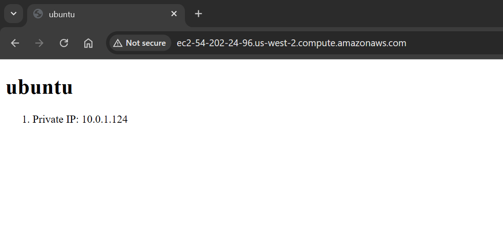

# 4640-w11-lab-start-w25

See lab instructions on D2L


 ## Prerequisites
- AWS account with appropriate permissions
- Terraform installed
- Ansible installed
- AWS CLI configured

## Setup

Run the terraform configuration first.

```
cd terraform
terraform init
terraform apply
```

## Running the Playbook

```
cd ansible
ansible-playbook -i inventory/aws_ec2.yml playbook.yml
```

## Accessing the Web Server

Once the playbook has run, you can access the web server at the public IP address of the Ubuntu frontend server.

## Screenshot of the Frontend Server




